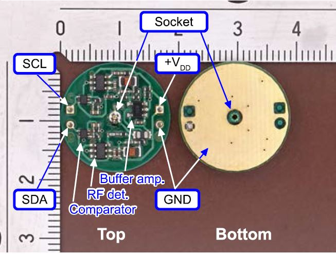

# Inter-Integrated Circuit for Wearables (I2We)

A research article related to this project has been published in IEEE Access: https://doi.org/10.1109/ACCESS.2021.3078133

## Introduction

This project present Inter-IC for Wearables (I2We), which enables the simultaneous transfer of Inter-Integrated Circuit (I2C)-formatted serial bitstream and dc power over a single transmission line consisting of a pair of conductive textiles. 

