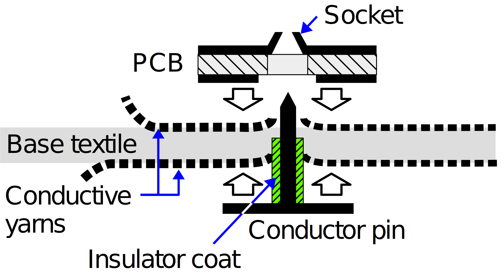
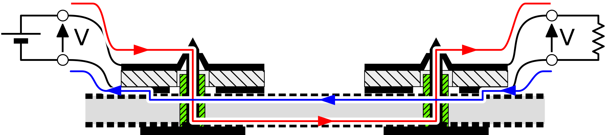
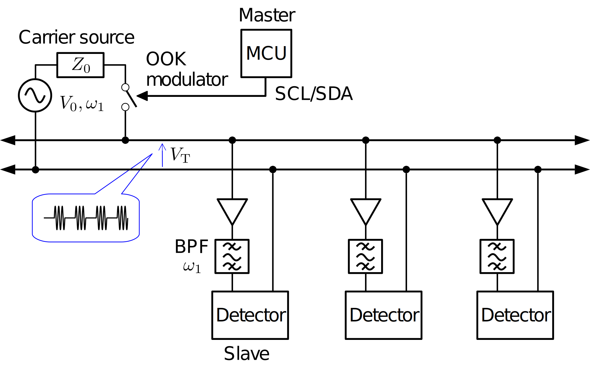
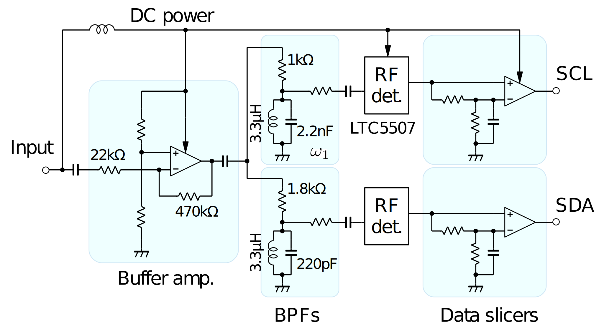
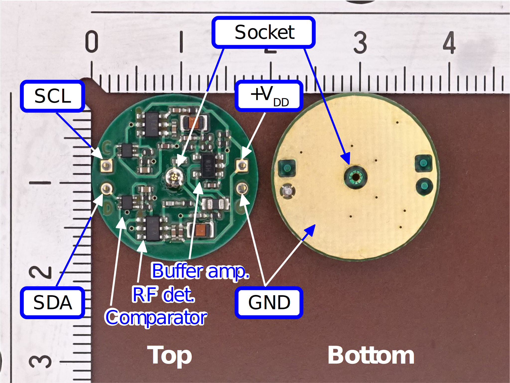

# Simplex Inter-Integrated Circuit for Wearables (S-I2We)

A research article related to this project has been published in IEEE Access: https://doi.org/10.1109/ACCESS.2021.3078133

## Introduction

This project presents Inter-IC for Wearables (I2We), which enables the simultaneous transfer of Inter-Integrated Circuit (I2C)-formatted serial bitstream and dc power over a single transmission line consisting of a pair of conductive textile sheets. 

## Principle

A pair of pin-and-socket connectors enable electrical connection between the circuit module and conductive textile transmission line at any arbitrary positions, as shown below.

All the devices are parallel-connected to the single transmission line. 
Two carrier frequencies are used to transfer the clock (SCL) and data (SDA) signals of the ordinary I2C bus. 
Each carrier is simplly on-off-keying (OOK)-modulated with the SCL and SDA.

## Implementation

An I2We demodulator implementation example is shown below. 
This repository includes PDF documents of the schematic diagram and the PCB patterns.

